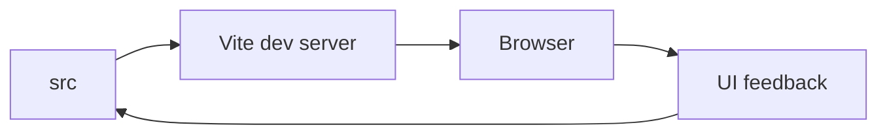

# ✨ ManoherAstro

<p align="center"></p>

<p align="center"><b>A Vite-based web application project in the Manoher/Astro project family.</b></p>

<p align="center">  </p>

## 📌 Overview
The repository contains a modern frontend scaffold with source code under `src/`, static files under `public/`, and Vite as the development/build tool.

## 🛠️ Setup
```bash
git clone https://github.com/Abhishek7258/ManoherAstro.git
cd ManoherAstro
npm install
npm run dev
```

Check `package.json` for the exact available scripts.

## 📁 Structure
```text
ManoherAstro/
├── public/
├── src/
├── index.html
├── package.json
├── vite.config.js
└── eslint.config.js
```

## 🧭 Development Flow


## 📸 Documentation
Add desktop and mobile screenshots to `docs/screenshots/` as the UI evolves. Screenshots make the repository much easier to understand before someone installs it.

## 📄 License
No license file is currently declared.